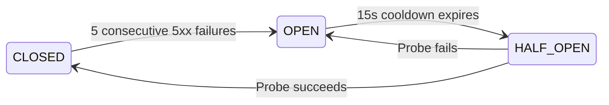

# HabeshaGo API Gateway: Architecture and Operational Guide

## 1. Executive Purpose & Architectural Boundaries

The API Gateway is HabeshaGo's **single public HTTP & WebSocket ingress**. It concentrates all cross-cutting infrastructure concerns into one place so downstream microservices never reimplement them.

### What the Gateway Does
- **Routing & Streaming Proxy**: Reverse-proxies client traffic (`/api/v1/*`) to 10 private microservices using non-blocking HTTP streaming.
- **Identity & Trust Boundary**: Validates public client access tokens (JWTs) and mints a short-lived, cryptographically signed internal identity token (`x-internal-token`) for microservices.
- **Traffic Protection**: Enforces payload size limits, rate limits (per IP, per user, and strict limits on auth routes), CORS, and security headers (Helmet).
- **Resilience & Fault Isolation**: Per-service circuit breakers (3-state) and timeouts to protect the platform from cascading upstream failures.
- **Real-time Streaming**: Authenticates and proxies WebSocket upgrade handshakes (e.g., live vehicle tracking in Mobility Service).
- **Observability**: Request correlation IDs (`x-request-id`), Prometheus metrics (`/metrics`), structured Pino logging, and Kubernetes health probes (`/health`, `/ready`).

### What the Gateway Does NOT Do
- **No Domain Business Logic**: Does not process payments, issue tickets, calculate bus fares, or manage fleet schedules.
- **No Database / Prisma**: Owns no Postgres schema and executes no SQL. Its only operational data store is Redis (for rate limits and caching).
- **No Event Publishing**: Does not publish or consume Kafka/RabbitMQ events; does not run outbox/inbox background workers.
- **No Payload Mutation**: Streams request/response bodies without JSON parsing or restructuring.

---

## 2. Request Lifecycle & Middleware Pipeline

Order is critical. Each middleware layer shields the layers that follow. Notice that health and metrics probes are mounted **before** rate limiters and security guards so infrastructure monitoring is never throttled:

```text
[ Client (Mobile / Web App) ]
              │
              ▼
    1. Request ID (x-request-id)               Generates/validates UUID
              │
              ▼
    2. Structured Access Logger (pino-http)    Logs method, URL, status, latency
              │
              ▼
    3. Prometheus Metrics Middleware           Starts request timer (httpDuration)
              │
              ├─▶ GET /health                  Liveness probe (200 OK)
              ├─▶ GET /ready                   Readiness probe (Redis ping)
              └─▶ GET /metrics                 Prometheus scraper endpoint
              │
              ▼
    4. Security Headers (Helmet) & CORS        Sanitizes headers, validates allowed origins
              │
              ▼
    5. Gzip Compression                        Gzips responses (skips SSE streams)
              │
              ▼
    6. Payload Size Guard (Content-Length)     Rejects bodies > MAX_BODY_BYTES (413)
              │
              ▼
    7. IP Rate Limiter (Redis)                 Global IP throttle (RATE_LIMIT_IP_PER_MINUTE)
              │
              ▼
    8. Authentication Filter                   Validates JWT; exempts publicRules
              │
              ▼
    9. Route Authorization                     Checks required roles (e.g. admin, employee)
              │
              ▼
   10. User Rate Limiter (Redis)               Authenticated user throttle (RATE_LIMIT_USER_PER_MINUTE)
              │
              ▼
   11. Identity Trust Boundary                 Strips client identity headers;
                                               Attaches signed x-internal-token
              │
              ▼
   12. Circuit Breaker Guard                   Rejects fast if upstream is failing (503)
              │
              ▼
   13. Streaming Proxy (http-proxy-middleware) Pipes body to microservice with timeout
              │
              ▼
[ Downstream Service (e.g., Ticket Service) ]
```

> **Why `express.json()` is NOT used globally**: Parsing the request body into a JavaScript object consumes the Node.js readable stream. If the gateway parses the body, the proxied request to the upstream service will hang or arrive with an empty body. The gateway streams the raw TCP payload directly.

---

## 3. The Trust Boundary (Zero-Trust Security)

Downstream microservices sit on a private Docker/VPC network and **never accept untrusted client headers directly**.

```text
Untrusted Client Headers                  Gateway Trust Barrier               Trusted Internal Request
┌─────────────────────────┐               ┌────────────────────┐               ┌───────────────────────────┐
│ x-user-id: "admin-123"  │ ────────────▶ │ 1. Strip untrusted │ ────────────▶ │ x-request-id: <uuid>      │
│ x-user-roles: "ADMIN"   │               │    headers         │               │ x-user-id: <verified-id>  │
│ x-internal-token: "..." │               │ 2. Verify token    │               │ x-user-roles: "PASSENGER" │
│ Authorization: Bearer   │               │ 3. Sign new token  │               │ x-internal-token: <jwt>   │
└─────────────────────────┘               └────────────────────┘               └───────────────────────────┘
```

### Identity Transformation
1. When a request arrives, `identityHeaders` middleware in [`../src/middleware/identity-headers.ts`](../src/middleware/identity-headers.ts) **deletes** any client-supplied identity headers:
   - `x-user-id`
   - `x-user-roles`
   - `x-session-id`
   - `x-internal-token`
   - `x-forwarded-user`
2. If the user is authenticated, the gateway mints a fresh **`x-internal-token`**:
   - **Algorithm**: `HS256`
   - **Issuer**: `"api-gateway"`
   - **Audience**: `"internal-services"`
   - **TTL**: 60 seconds (configured via `INTERNAL_TOKEN_TTL_SECONDS`)
   - **Payload**: `{ sub: user.id, roles: user.roles, sid: user.sessionId, rid: req.id }`

### Downstream Service Verification Package
To keep `@habeshago/api-contracts` clean (schemas and types only, safe for web and mobile), the downstream verification middleware is packaged separately in **`@habeshago/service-auth`** ([`../../packages/service-auth/src/index.ts`](../../packages/service-auth/src/index.ts)):

```typescript
import { requireGateway } from "@habeshago/service-auth";

// Mount this in every downstream microservice to enforce gateway trust
app.use(requireGateway(process.env.INTERNAL_JWT_SECRET));
```
Direct access to a service from outside the cluster or bypassing the gateway is strictly blocked with `401 UNAUTHORIZED`.

---

## 4. Upstream Microservice Routing Table

Routes are declaratively registered in [`../src/config/services.ts`](../src/config/services.ts). Adding a service requires only one configuration entry:

| Service | Route Prefix | Target Env Var | Auth Policy | Timeout | WebSocket |
|---|---|---|---|---|:---:|
| **Auth** | `/api/v1/auth` | `AUTH_SERVICE_URL` | User (Login, register, Google OAuth exempt via `publicRules`) | 8s | No |
| **Profile** | `/api/v1/profiles` | `PROFILE_SERVICE_URL` | User | 8s | No |
| **Mobility** | `/api/v1/mobility` | `MOBILITY_SERVICE_URL` | User | 10s | **Yes** |
| **Ticket** | `/api/v1/tickets` | `TICKET_SERVICE_URL` | User | 10s | No |
| **Payment** | `/api/v1/payments` | `PAYMENT_SERVICE_URL` | User (Chapa webhook is public) | 15s | No |
| **Parking** | `/api/v1/parking` | `PARKING_SERVICE_URL` | User | 8s | No |
| **EV** | `/api/v1/ev` | `EV_SERVICE_URL` | User | 8s | No |
| **Employee**| `/api/v1/employees` | `EMPLOYEE_SERVICE_URL` | Roles: `admin`, `employee` | 8s | No |
| **Notification** | `/api/v1/notifications`| `NOTIFICATION_SERVICE_URL`| User | 8s | No |
| **Reporting** | `/api/v1/reports` | `REPORTING_SERVICE_URL` | Roles: `admin` | 25s | No |

---

## 5. Resilience & Fault Isolation

### Correct 3-State Circuit Breaker Flow
Every upstream microservice is shielded by an independent `CircuitBreaker` instance in [`../src/proxy/circuit-breaker.ts`](../src/proxy/circuit-breaker.ts):

```text
                       5 consecutive 5xx failures
             ┌──────────────────────────────────────────┐
             │                                          ▼
       ┌───────────┐                              ┌───────────┐
       │  CLOSED   │                              │   OPEN    │ ◄──┐
       │ (Normal)  │                              │ (Tripped) │    │
       └───────────┘                              └───────────┘    │
             ▲                                          │          │
             │                                          │ 15s      │ Probe
             │ Probe succeeds                           │ Cooldown │ fails
             │                                          ▼          │
             └──────────────────────────────────  ┌───────────┐    │
                                                  │ HALF-OPEN │ ───┘
                                                  │  (Probe)  │
                                                  └───────────┘
```



1. **CLOSED (Normal Operation)**:
   - Traffic flows through to the microservice normally.
2. **CLOSED $\rightarrow$ OPEN**:
   - When a service fails 5 consecutive times (`failureThreshold = 5`), the breaker **trips OPEN**.
   - While OPEN, all requests for this service are rejected immediately with `503 SERVICE_UNAVAILABLE` without sending traffic to the broken upstream.
3. **OPEN $\rightarrow$ HALF-OPEN**:
   - After a 15-second cooldown (`cooldownMs = 15000`), the breaker enters **HALF-OPEN** to test recovery.
4. **HALF-OPEN $\rightarrow$ CLOSED (Success)**:
   - If the probe request succeeds, the failure counter resets to 0 and the breaker closes.
5. **HALF-OPEN $\rightarrow$ OPEN (Failure)**:
   - If the probe request fails, the breaker immediately reopens for another 15-second cooldown.

### 4xx Client Errors vs 5xx Server Errors
In [`../src/proxy/create-proxy.ts`](../src/proxy/create-proxy.ts):
```typescript
if ((proxyRes.statusCode ?? 500) >= 500) {
  breaker.failure();  // Only 5xx server crashes count as failures!
} else {
  breaker.success();  // 400 Bad Request or 404 Not Found do NOT trip the breaker
}
```
Client errors are the caller's fault and do not indicate that the microservice is down.

### Upstream Timeout and Failure Error Mapping
- Upstream connection timeouts (`proxyTimeout`) map to **`504 UPSTREAM_TIMEOUT`**:
  ```json
  {
    "error": {
      "code": "UPSTREAM_TIMEOUT",
      "message": "mobility did not respond in time",
      "requestId": "c1f77d85-3e28-485a-a302-36c5617a942b"
    }
  }
  ```
- Connection refused errors (`ECONNREFUSED` / `ENOTFOUND`) or open circuit breakers map to **`503 SERVICE_UNAVAILABLE`**:
  ```json
  {
    "error": {
      "code": "SERVICE_UNAVAILABLE",
      "message": "mobility is temporarily unavailable",
      "requestId": "c1f77d85-3e28-485a-a302-36c5617a942b"
    }
  }
  ```

---

## 6. Rate Limiting Architecture & Real-World Edge Cases

Rate limiting is powered by `ioredis` and `rate-limit-redis` in [`../src/middleware/rate-limit.ts`](../src/middleware/rate-limit.ts):

1. **IP Rate Limit** (`RATE_LIMIT_IP_PER_MINUTE`, default: 300):
   - Applied to **every incoming request** across the board, keyed by client IP (`req.ip`).
   - Acts as an infrastructure umbrella against volumetric DDoS.
2. **User Rate Limit** (`RATE_LIMIT_USER_PER_MINUTE`, default: 120):
   - Applied to authenticated requests, keyed by `req.user.id`.
   - Prevents a single authenticated user from monopolizing resources.
3. **Strict Auth Endpoint Rate Limit** (20 requests per 15 minutes):
   - Applied to `/api/v1/auth/login` and `/api/v1/auth/register`.
   - **Carrier CGNAT & Shared IP Warning**: In mobile carrier networks, thousands of mobile devices may share a single gateway public IP (Carrier-Grade NAT). An aggressive IP limiter on login can unintentionally throttle legitimate users on the same cell tower.
   - **Architectural Division**: The API Gateway throttles volumetric brute force at the IP level. **Per-account lockout** (e.g., locking an account after 5 failed password attempts) **must be enforced inside `auth-service`**, because the gateway never inspects the login request body.
4. **Resilience**: Configured with `passOnStoreError: true`. If Redis becomes temporarily unreachable, requests are permitted through so a Redis glitch never causes a full gateway outage.

---

## 7. Security Hardening & Trust Architecture

### 1. Symmetric (HS256) vs Asymmetric (RS256 / Ed25519) Signing
- **Current State**: Uses symmetric `HS256` with a shared secret (`INTERNAL_JWT_SECRET`).
- **Limitation**: Any downstream microservice that holds the symmetric secret could theoretically forge an internal token for any user.
- **Recommended Evolution**: Move to asymmetric cryptography (`RS256` or `Ed25519`). The Gateway holds the private key and signs tokens; microservices hold only the public key (or fetch it via a local JWKS endpoint) and verify tokens without having the capability to forge them. Include a Key ID (`kid`) in the JWT header to allow zero-downtime key rotation.

### 2. Protecting `/metrics`
- The `/metrics` endpoint exposes Prometheus counters, histograms, and route labels.
- **Security Rule**: `/metrics` must never be exposed to the public internet. Restrict it at the reverse proxy (NGINX/ALB) or bind it to an internal management subnet.

### 3. Client IP Resolution (`trust proxy`)
- The gateway configures `app.set("trust proxy", 1)`.
- If running behind a single load balancer (AWS ALB, Cloudflare), `1` trusts the first hop in `X-Forwarded-For`.
- If running behind multiple proxies (e.g. Cloudflare $\rightarrow$ AWS ALB $\rightarrow$ Gateway), adjust the hop count accordingly. If misconfigured, rate limiters will group all users under the load balancer's private IP.

---

## 8. WebSocket Operational Details (Mobility Service)

WebSocket upgrade requests are intercepted before Express routing in [`../src/server.ts`](../src/server.ts):

1. **Authentication**:
   - Header: `Authorization: Bearer <token>` (preferred for mobile clients).
   - Query Parameter: `?access_token=<token>` (fallback for clients that cannot set WebSocket headers).
   - **Security Note**: Query tokens can appear in access logs or browser history. The gateway deletes the `access_token` query parameter from `req.url` before handing the socket to the proxy.
2. **Mid-Connection Token Expiration**:
   - The gateway validates the token only during the initial HTTP `Upgrade` handshake.
   - Once the TCP socket is upgraded to a bidirectional WebSocket, the gateway pipes raw frames.
   - **Mobility Service Responsibility**: The mobility service must manage session lifetime, send periodic WebSocket ping/pong frames, and enforce connection limits per user.

---

## 9. Standard Error Code Catalog

Every error generated by the gateway conforms to `errorResponseSchema` from `@habeshago/api-contracts`:

| HTTP Status | Machine Error Code | Meaning | Client Remediation |
|:---:|---|---|---|
| `400` | `BAD_REQUEST` | Malformed request or invalid parameters | Check request format |
| `401` | `UNAUTHORIZED` | Missing, invalid, or expired Bearer token | Refresh tokens or redirect to login |
| `403` | `FORBIDDEN` | User lacks required role/permission | Display permission denied |
| `404` | `NOT_FOUND` | Route does not exist on gateway | Verify API URL path |
| `413` | `PAYLOAD_TOO_LARGE` | Body exceeds `MAX_BODY_BYTES` (1MB) | Compress payload or upload to S3/Cloudinary |
| `429` | `RATE_LIMITED` | Too many requests per time window | Read `Retry-After` header and back off |
| `502` | `BAD_GATEWAY` | Upstream service returned an invalid response | Retry with exponential backoff |
| `503` | `SERVICE_UNAVAILABLE` | Circuit breaker open or service offline | Display temporary outage notice |
| `504` | `UPSTREAM_TIMEOUT` | Upstream service exceeded timeout budget | Retry idempotent queries; alert support |
| `500` | `INTERNAL_ERROR` | Unhandled gateway runtime exception | Alert platform engineering |

---

## 10. Environment Variable Reference

| Variable | Type | Default | Required? | What Breaks If Misconfigured |
|---|:---:|:---:|:---:|---|
| `NODE_ENV` | `enum` | `"development"` | No | Production mode enables structured JSON logs |
| `PORT` | `number` | `8080` | No | Gateway fails to bind if port is in use |
| `LOG_LEVEL` | `string` | `"info"` | No | Log verbosity (`debug`, `info`, `warn`, `error`) |
| `CORS_ORIGINS` | `csv` | — | **Yes** | Web app requests fail with CORS errors |
| `REDIS_URL` | `url` | — | **Yes** | Rate limiting falls back to in-memory/bypass mode |
| `JWT_ACCESS_SECRET` | `string` | — | **Yes** (min 16 chars) | User authentication fails with 401 |
| `INTERNAL_JWT_SECRET` | `string` | — | **Yes** (min 16 chars) | Microservices reject gateway requests |
| `INTERNAL_TOKEN_TTL_SECONDS` | `number` | `60` | No | Short TTL prevents replay attacks |
| `MAX_BODY_BYTES` | `number` | `1048576` (1MB) | No | Requests larger than limit receive 413 |
| `RATE_LIMIT_IP_PER_MINUTE` | `number` | `300` | No | Overly strict values lock out users |
| `RATE_LIMIT_USER_PER_MINUTE`| `number` | `120` | No | Limits per-user request burst |
| `AUTH_SERVICE_URL` | `url` | — | **Yes** | `/api/v1/auth/*` returns 503 |
| `MOBILITY_SERVICE_URL` | `url` | — | **Yes** | `/api/v1/mobility/*` returns 503 |
| `TICKET_SERVICE_URL` | `url` | — | **Yes** | `/api/v1/tickets/*` returns 503 |
| `PAYMENT_SERVICE_URL` | `url` | — | **Yes** | `/api/v1/payments/*` returns 503 |
| *(Remaining Service URLs)* | `url` | — | **Yes** | Associated service routes return 503 |

---

## 11. How to Add a New Microservice (5-Step Checklist)

When extracting or adding a new microservice (e.g., `parcel-service`):

1. **Add Environment Variable**:
   In [`../src/config/env.ts`](../src/config/env.ts), add `PARCEL_SERVICE_URL: url` to the `parseEnv` schema and update `.env.example`.
2. **Add Table Entry in `services.ts`**:
   In [`../src/config/services.ts`](../src/config/services.ts), add the route configuration:
   ```typescript
   {
     ...base,
     name: "parcel",
     prefix: "/api/v1/parcels",
     target: env.PARCEL_SERVICE_URL,
     timeoutMs: 8000,
     retries: 0,
   }
   ```
3. **Set Authentication & Authorization Policy**:
   Define `publicRules` if specific routes are public, or add `roles: ["admin"]` if restricted.
4. **Add Contract Test**:
   In [`../tests/contracts/contracts.test.ts`](../tests/contracts/contracts.test.ts), verify that the new service entry matches the required naming and health specifications.
5. **Add Docker Compose Service**:
   In [`../../infrastructure/compose/docker-compose.yml`](../../infrastructure/compose/docker-compose.yml), define the service container and inject `PARCEL_SERVICE_URL: http://parcel-service:4011`.

---

## 12. Operational Runbook & Alert Triage

| Alert / Symptom | Probable Cause | Immediate Action |
|---|---|---|
| **`gateway_circuit_breaker_open{service="payment"}`** | Payment Service crashed or Chapa API is failing | Check `payment-service` logs and external Chapa status. The breaker will probe recovery automatically after 15s. |
| **High `429` rate limit rejections** | User traffic burst, scraping, or shared mobile carrier IP | Check `gateway_rate_limited_total{scope="ip"}`. If on auth routes, investigate possible credential stuffing attacks. |
| **Spike in `504 UPSTREAM_TIMEOUT`** | Slow database query or thread starvation in upstream service | Check upstream CPU/memory and Postgres connection pool saturation. |
| **Readiness probe `/ready` returning 503** | Redis instance is down or unreachable | Verify Redis process or Upstash TLS connectivity. Gateway continues serving with `passOnStoreError: true`. |
| **High memory usage on API Gateway** | Streaming stalled or high concurrent WebSocket connections | Check connection counts on `mobility-service` WebSocket proxy. |

---

## 13. Scaling, High Availability & Deployment

- **Stateless Replicas**: The API Gateway is fully stateless. Always run a minimum of **2 instances** behind a load balancer for high availability and rolling zero-downtime deployments.
- **HTTP Keep-Alive Configuration**:
  ```typescript
  server.keepAliveTimeout = 65_000;
  server.headersTimeout = 66_000;
  server.requestTimeout = 30_000;
  ```
  `keepAliveTimeout` is configured to 65s (higher than AWS ALB's 60s default) to eliminate sporadic `502 Bad Gateway` errors caused by race conditions during connection reuse.
- **Graceful Shutdown & Drain Window**:
  On `SIGTERM` / `SIGINT`, the gateway stops accepting new connections and initiates a **15-second drain window** to allow in-flight streaming requests to finish before closing Redis connections and exiting.

---

## 14. Architecture Decisions & Known Limits

1. **No Automatic Retries by Design**:
   Retrying a streamed HTTP request is unsafe because the request stream body is already consumed. Idempotency must be managed by the client using an `Idempotency-Key` header handled inside `payment-service` and `ticket-service`.
2. **No Premature Caching or Aggregation**:
   The gateway does not cache domain queries or aggregate screens. Caching belongs at the edge (CDN) or inside specific domain services.
3. **Strict Versioning**:
   All public APIs are explicitly namespaced under `/api/v1/`. Breaking changes require mounting `/api/v2/`.
